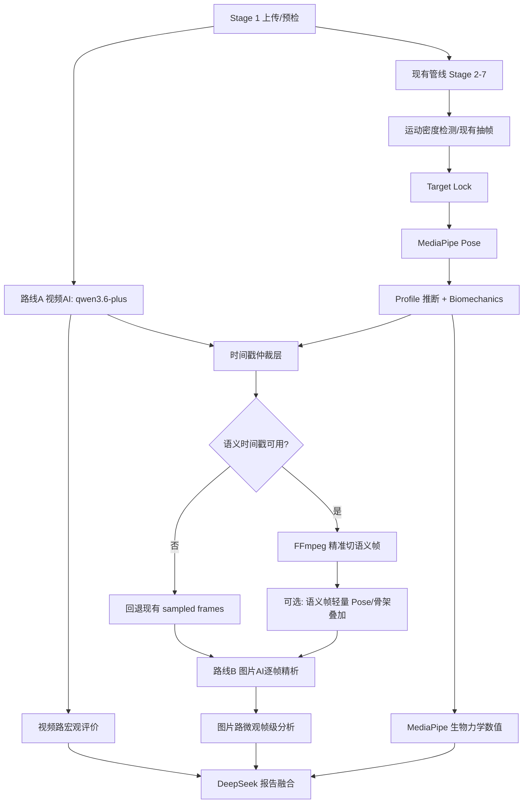

# Codex 开发任务文档：视频 AI 语义定位 + 图片 AI 精细分析双路改造 v5

## 0. 背景与目标

当前核心痛点不是图片 AI 能力本身，而是关键帧定位错误：

```text
骨架推算时间戳不准
  -> FFmpeg 切错帧
  -> 图片 AI 分析错误内容
  -> 最终报告失真
```

本轮 v5 改造目标：

```text
视频 AI 语义定位
  -> 阶段区间 + key_frame_hint
  -> 时间戳仲裁层二次确认
  -> FFmpeg 精准切语义关键帧
  -> 图片 AI 分析正确帧
  -> 视频宏观评价 + 图片微观分析 + MediaPipe 数值融合报告
```

重要原则：

- 不再把 MediaPipe 骨架推算时间戳作为唯一关键帧来源。
- MediaPipe 生物力学管线必须保留，不删除、不替代。
- 视频 AI 不作为逐帧裁判，只负责语义阶段区间和宏观评价。
- 最终切帧时间必须经过二次确认：视频 AI 区间 + 运动密度 + 骨架候选。
- 默认视觉模型统一使用 `qwen3.6-plus`。
- 不再推荐 `qwen-vl-max-latest`，因为 VL-Max 有下线风险。
- 不使用本地花滑样本作为验收前提；测试改用 mock provider、合成视频、单元测试。
- 输出报告面向 5-8 岁儿童和家长，中文、鼓励性、训练导向。

---

## 1. 目标架构



路线分工：

- 视频路：完整视频理解，输出动作阶段区间、动作类型确认、宏观技术评价、整体印象、置信度。
- 时间戳仲裁层：把视频 AI 的语义区间转成可切帧的真实时间点。
- 图片路：分析语义正确的关键帧，聚焦姿态、刃面、轴心、膝踝缓冲、手臂协调等微观细节。
- MediaPipe：继续提供姿态点、角度、重心、旋转估计、稳定性等数值证据。
- 报告层：融合视频宏观、图片微观、MediaPipe 数值，冲突时保守表达。

执行顺序：

- Stage 1 预检后，视频 AI 与现有 Stage 2-7 可以并行启动。
- 图片路必须等待时间戳仲裁完成，因为图片路依赖语义帧。
- 报告生成必须等待视频路、图片路、MediaPipe 结果都完成或明确 fallback。

---

## 2. 仓库事实与开发约束

真实后端代码位于：

- `backend/app/routers/analysis.py`
- `backend/app/services/video.py`
- `backend/app/services/providers.py`
- `backend/app/services/vision_path_a.py`
- `backend/app/services/vision_path_b.py`
- `backend/app/services/vision_dual.py`
- `backend/app/services/report.py`

注意：

- `ai_skating_analysis_pack/` 是快照/交付包，不是首要运行代码。
- 除非任务明确要求同步文档或快照，否则核心实现应落在 `backend/app/`。
- 当前已有 `request_dashscope_video_completion()`、`cut_action_window_clip()`、`vision_path_a` 视频模式、`vision_dual` 双路编排。
- 当前双路偏向“原始帧/骨架叠加帧并行分析”，本轮要改为“视频先给语义时间，图片再精析语义帧”。

部署约束：

- Synology NAS + Docker，CPU 资源有限。
- 不引入重型本地视频模型。
- 视觉分析成本上限约 30 元人民币/天。
- 优先国内可访问 AI 服务。
- 首版强制目标模型：`qwen3.6-plus`。
- DeepSeek 继续用于报告生成。
- Doubao/Kimi 暂不进入首版自动复核，保留二期评估空间。

---

## 3. 核心设计：视频 AI 输出区间，系统二次确认帧点

不要直接让视频 AI 输出最终精确帧点。更稳的方式是：

```text
视频 AI 输出：
  - phase interval: 起跳 2.10-2.50s
  - key_frame_hint: 2.32s
  - confidence: 0.82

系统二次确认：
  - 在 2.10-2.50s 内查 motion peak
  - 若 skeleton T 候选落在区间内且可信，优先用 skeleton T
  - 若 skeleton 不可靠，用 motion peak
  - 若都弱，用 key_frame_hint
```

原因：

- 视频 AI 的时间定位是语义级，不是逐帧级。
- 当前 DashScope 视频调用通常会以低 fps 采样，时间分辨率不适合直接精确到帧。
- FFmpeg 精准切帧应基于真实视频时间轴，不能直接相信模型的单点时间。
- 视频 AI 擅长判断“哪个时间段是起跳/腾空/落冰”，运动密度和骨架候选更适合在区间内定位动作突变点。

最终规则：

```text
视频AI负责：语义定位，给阶段区间
运动密度负责：区间内找动作突变点
MediaPipe负责：验证 T/A/L 生物力学合理性
FFmpeg负责：按仲裁后的真实 timestamp 切帧
```

---

## 4. 新增数据契约

### 4.1 `VideoTemporalAnalysis`

建议新增模块：

- `backend/app/services/video_temporal.py`
- 测试：`backend/tests/test_video_temporal.py`

核心输出结构：

```json
{
  "schema_version": "video_temporal_v1",
  "provider": "qwen",
  "model": "qwen3.6-plus",
  "action_confirmation": {
    "action_family": "jump",
    "confirmed_action": "Axel",
    "jump_type": "Axel",
    "confidence": 0.78,
    "notes": ""
  },
  "phase_segments": [
    {
      "phase_code": "takeoff",
      "phase_label": "起跳",
      "time_start": 2.1,
      "time_end": 2.5,
      "key_frame_hint": 2.32,
      "confidence": 0.76,
      "observations": [],
      "issues": []
    }
  ],
  "key_moments": {
    "T_takeoff_sec": 2.32,
    "A_air_sec": 2.62,
    "L_landing_sec": 2.91
  },
  "macro_assessment": {
    "timing_rhythm": "",
    "speed_flow": "",
    "axis_overall": "",
    "entry_quality": "",
    "exit_or_landing_quality": "",
    "top_strengths": [],
    "top_issues": []
  },
  "overall_impression": "",
  "camera_view": "diagonal_front",
  "data_quality_hint": "partial",
  "confidence": 0.78,
  "fallback_recommendation": "use_video_timestamps",
  "quality_flags": []
}
```

### 4.2 `ResolvedKeyframePlan`

时间戳仲裁层输出：

```json
{
  "source": "video_ai_refined",
  "confidence": 0.82,
  "quality_flags": [],
  "selected": [
    {
      "frame_id": "semantic_0001",
      "timestamp": 2.17,
      "phase_code": "takeoff",
      "phase_label": "起跳",
      "key_moment": "T_takeoff_sec",
      "selection_reason": "video_phase_range_motion_peak"
    }
  ],
  "video_ai": {}
}
```

该结构合并进 `frame_motion_scores`：

```json
{
  "...existing": "...",
  "video_temporal": {},
  "resolved_keyframes": {}
}
```

首版不新增强制数据库迁移。

---

## 5. Prompt 模板

### 5.1 视频 AI System Prompt

```text
你是一名专业花样滑冰技术分析师，熟悉儿童初级训练、ISU 技术要素、基础运动生物力学和视频时间定位。

你的任务是直接分析完整动作视频，输出动作阶段的时间区间、动作类型确认、宏观技术评价和整体印象。

要求：
1. 只输出一个合法 JSON 对象，不要输出 Markdown、解释或代码块。
2. 所有时间戳单位为秒，基于源视频从 0.000 秒开始的播放时间轴。
3. 如果无法判断，使用 null 或 “不可分析”，不要编造。
4. 目标学员为 5-8 岁儿童，评价要使用儿童训练标准，不使用成人竞技标准。
5. 你只负责视频宏观时序和整体质量判断，不输出骨架测量数值。
6. 对高速跳跃动作，给出阶段区间，不要假装能锁定单个绝对精确帧。
7. 时间保留一位或两位小数即可，允许约 0.5-1 秒误差。
```

### 5.2 视频 AI User Prompt

```text
请分析这段花样滑冰训练视频。

已知信息：
- action_type_hint: {{action_type}}
- action_subtype_hint: {{action_subtype_or_unknown}}
- skater_level: 儿童初级 / Free Skate 1
- video_duration_sec: {{duration}}
- source_fps: {{source_fps}}
- model: qwen3.6-plus

需要覆盖的动作类型：
- 跳跃：Lutz, Flip, Loop, Salchow, Toe Loop, Axel
- 非跳跃：旋转、步法、螺旋线

请完成：
1. 确认实际动作类型和子类型。
2. 输出每个动作阶段的 time_start/time_end。
3. 对每个关键阶段输出 key_frame_hint，表示该阶段最有代表性的时间点。
4. 对跳跃给出 T/A/L 建议时间：
   T = 起跳离冰附近，A = 腾空最高或最稳定旋转附近，L = 落冰触冰附近。
5. 输出宏观技术评价：节奏、速度、轴心、入跳/入转、落冰/出转/滑出、整体流畅度。
6. 输出整体印象和置信度。
7. 如果主滑行者不清楚、多人遮挡、画面太远或动作不完整，请降低 confidence 并说明原因。

只输出 JSON，schema_version 必须为 "video_temporal_v1"。
```

### 5.3 图片 AI Prompt 调整

图片 AI 不再从零猜阶段，而是在语义上下文中做帧级验证。

每帧追加上下文：

```json
{
  "video_context": {
    "confirmed_action": "Axel",
    "phase_label": "腾空",
    "timestamp_sec": 2.43,
    "phase_time_start": 2.10,
    "phase_time_end": 2.72,
    "key_moment": "A_air_sec",
    "macro_axis_overall": "整体轴心略向左偏，但滑出可控",
    "camera_view": "diagonal_front",
    "video_confidence": 0.78
  }
}
```

图片 AI 输出新增字段：

```json
{
  "phase_verification": "agree|shifted|disagree|uncertain",
  "conflict_with_video_context": false,
  "video_context_note": ""
}
```

规则：

- 优先分析姿态、刃面、轴心、膝踝缓冲、手臂协调。
- 可以挑战视频 AI 上下文，但必须说明原因。
- 刃面不可见时输出“不可判断”，不要猜 Lutz/Flip 内外刃。
- 对儿童使用鼓励性、训练导向表达。
- 冲突时图片帧级结论优先，但报告中保留视频路宏观观察差异。

---

## 6. 时间戳仲裁策略

建议新增函数：

```python
resolve_semantic_keyframes(
    video_ai_result: dict | None,
    skeleton_timestamps: dict | None,
    motion_scores: dict | None,
    *,
    video_duration_sec: float,
    analysis_profile: str | None,
) -> dict
```

仲裁逻辑：

```python
confidence = video_ai_result.get("confidence", 0)

if confidence >= 0.80:
    # 视频 AI 高置信：使用视频 AI 阶段区间
    # 但不要直接取中点，在区间内用运动密度峰值/最近骨架候选做 refine
    source = "video_ai_refined"

elif confidence >= 0.55:
    # 中置信：视频 AI 区间作为边界
    # 优先选落在区间内的 skeleton T/A/L；没有则选区间运动峰值
    source = "blended"

else:
    # 低置信：回退现有骨架/运动采样
    source = "skeleton_fallback"
```

有效性阈值：

- `confidence < 0.55`：不用于切语义帧。
- 关键 phase confidence `< 0.60`：该 phase 单独回退。
- 时间戳越界、`time_end <= time_start`、阶段严重重叠：标记 invalid。
- 跳跃若 T/A/L 顺序不满足 `T < A < L`：不直接失败，转 blended 或 fallback。
- `fallback_recommendation != "use_video_timestamps"`：默认不直接使用视频时间戳。

候选帧策略：

- 每个关键阶段至少 1 张中心/峰值帧。
- 跳跃 T/A/L 各取目标点及可选 `±0.15s`，总数控制在 6-12 张。
- 旋转取 `spin_entry`、`spin_main` 2-4 张、`spin_exit`。
- 步法/螺旋线按阶段均匀取 6-10 张。
- 超预算时保留关键 moment，减少上下文帧。

---

## 7. 分阶段 Codex 开发任务

### Phase 1: 模型切换与现状清理

**Task V5-P1-01**  
标题：移除 `qwen-vl-max-latest` 默认依赖，统一默认视觉模型为 `qwen3.6-plus`  
思考等级推荐：medium  
涉及文件：

- `backend/app/services/providers.py`
- `README.md`
- `README.zh.md`
- `backend/tests/test_*vision*`
- `backend/tests/test_providers_vision_content.py`

实现要求：

1. 将 `DEFAULT_QWEN_VISION_MODEL` 改为 `qwen3.6-plus`。
2. README 中 `QWEN_VISION_MODEL=qwen-vl-max-latest` 改为 `qwen3.6-plus`。
3. 测试 fixture 中不再默认使用 `qwen-vl-max-latest`。
4. 保留向后兼容：如果用户环境显式配置旧模型，不在本任务中阻止启动，但日志可提示 deprecated。

验收标准：

- `rg "qwen-vl-max-latest" backend README.md README.zh.md` 只允许出现在兼容/迁移说明里。
- provider preset 仍能 seed `qwen3.6-plus`。
- 相关单测通过。

---

### Phase 2: 视频 AI 时间定位 schema

**Task V5-P2-01**  
标题：新增 `video_temporal.py` 的 schema normalizer 和 validator  
思考等级推荐：high  
涉及文件：

- `backend/app/services/video_temporal.py`
- `backend/tests/test_video_temporal.py`

实现要求：

1. 新增 `normalize_video_temporal_payload(raw, provider, model)`。
2. 新增 `validate_video_temporal_payload(payload, duration_sec)`。
3. clamp 所有 confidence 到 `0.0-1.0`。
4. 规范 phase code：
   - jump: `approach/preparation/takeoff/air/landing/glide_out`
   - spin: `spin_entry/spin_main/spin_exit`
   - step: `step_sequence`
   - spiral: `spiral_entry/spiral_hold/spiral_exit`
5. 输出 `quality_flags`，不要抛出裸异常。
6. 无效 payload 返回 `valid=False` 诊断结构，供 fallback 使用。

验收标准：

- 覆盖合法 payload、缺字段、时间越界、低置信、T/A/L 乱序。
- 不依赖网络。

---

### Phase 3: 视频 AI prompt 与 Qwen 3.6 Plus 调用

**Task V5-P3-01**  
标题：新增视频时间定位 prompt builder  
思考等级推荐：high  
涉及文件：

- `backend/app/services/video_temporal.py`
- `backend/tests/test_video_temporal_prompt.py`

实现要求：

1. 实现 `build_video_temporal_prompts(...) -> tuple[str, str]`。
2. prompt 使用本文第 5 节模板。
3. 明确写入 `qwen3.6-plus`，不再推荐 vl-max。
4. JSON schema 写入 prompt，但保持简洁，避免 token 过大。

验收标准：

- 单测检查 prompt 包含 `video_temporal_v1`、动作覆盖、儿童标准、只输出 JSON、时间戳单位秒。

**Task V5-P3-02**  
标题：封装 `analyze_video_temporal()`  
思考等级推荐：high  
涉及文件：

- `backend/app/services/video_temporal.py`
- `backend/app/services/providers.py`
- `backend/tests/test_video_temporal_provider.py`

实现要求：

1. 复用现有 `request_dashscope_video_completion()`，不直接 `httpx.post`。
2. provider 限定首版使用 qwen。
3. 使用 `qwen3.6-plus` active provider。
4. API 失败、超时、JSON 解析失败时返回 fallback diagnostic，不阻塞主流程。
5. 成本闸门复用/扩展现有 `QWEN_VISION_DAILY_COST_LIMIT_CNY`。

验收标准：

- mock `request_dashscope_video_completion()` 返回合法 JSON 可 normalize。
- mock 超时返回 `fallback_recommendation=use_existing_skeleton_timestamps` 或等价诊断。
- 不访问真实网络。

---

### Phase 4: 精确 FFmpeg 语义抽帧

**Task V5-P4-01**  
标题：新增精确按时间点抽帧函数  
思考等级推荐：xhigh  
涉及文件：

- `backend/app/services/video.py`
- `backend/tests/test_video_precise_extract.py`

实现要求：

1. 新增 `extract_precise_frames_at_timestamps(video_path, frames_dir, selected_records, prefix="semantic")`。
2. 关键帧抽取不要只用输入前 `-ss` 快速 seek。
3. 使用输出侧 `-ss` 或 `select='gte(t,TS)'` 方案，减少 GOP 偏移。
4. 输出文件命名稳定：`semantic_0001.jpg`。
5. 返回 `FramePayload` 兼容的 timestamp map 记录。
6. 失败时抛出可分类错误，由 pipeline fallback。

验收标准：

- 用合成短视频测试输出数量、文件命名、timestamp metadata。
- 不要求真实花滑样本。

---

### Phase 5: 时间戳仲裁层

**Task V5-P5-01**  
标题：实现 `resolve_semantic_keyframes()`  
思考等级推荐：xhigh  
涉及文件：

- `backend/app/services/video_temporal.py`
- `backend/tests/test_video_temporal_resolver.py`

实现要求：

1. 输入视频 AI 结果、现有 `motion_scores`、`bio_data.key_frame_candidates`。
2. 高置信走 `video_ai_refined`：视频阶段区间内选择运动峰值或 key moment 附近。
3. 中置信走 `blended`：视频区间约束 + 骨架 T/A/L 优先。
4. 低置信走 `skeleton_fallback`。
5. 输出 `ResolvedKeyframePlan`，包括 `source/confidence/quality_flags/selected`。
6. selected 控制在图片 AI 成本预算内，默认最多 12 帧。

验收标准：

- 覆盖高置信、中置信、低置信、无 motion score、T/A/L 乱序、越界。
- 所有输出可 JSON 序列化。

---

### Phase 6: 插入分析管线

**Task V5-P6-01**  
标题：在 `analysis.py` 中并行启动视频 AI 与现有 Stage 2-7  
思考等级推荐：xhigh  
涉及文件：

- `backend/app/routers/analysis.py`
- `backend/tests/test_analysis_video_temporal_pipeline.py`

实现要求：

1. Stage 1 `precheck_video()` 后创建视频 AI async task。
2. 现有 `extract_frames -> pose -> biomechanics` 主链路保持不动。
3. biomechanics 完成后等待视频 AI task，设置合理 timeout。
4. 调用 `resolve_semantic_keyframes()`。
5. 如果 resolver 产出语义时间戳，调用精确 FFmpeg 抽帧，生成 `semantic_frames`。
6. 如果任一环节失败，完全回退 `sampled_frames`，现有流程继续。
7. 将 `video_temporal` 和 `resolved_keyframes` 合并进 `analysis.frame_motion_scores`。

验收标准：

- mock 视频 AI 成功时，`frame_motion_scores` 包含 `video_temporal` 和 `resolved_keyframes`。
- mock 视频 AI 失败时，原分析流程不失败。
- retry from `pose/biomechanics/vision` 时行为明确：已有 `video_temporal` 可复用，否则 fallback。

---

### Phase 7: 图片 AI 使用语义帧与视频上下文

**Task V5-P7-01**  
标题：让图片 AI 接收语义帧和 `video_context`  
思考等级推荐：high  
涉及文件：

- `backend/app/services/vision_path_a.py`
- `backend/app/services/vision_path_b.py`
- `backend/app/services/vision_dual.py`
- `backend/tests/test_vision_video_context.py`

实现要求：

1. `analyze_frames_dual()` 新增可选参数 `video_temporal`、`resolved_keyframes`。
2. 图片帧 payload 仍用 `FramePayload`，但 prompt 中加入 `video_context`。
3. Path A/B schema 新增：
   - `phase_verification`
   - `conflict_with_video_context`
   - `video_context_note`
4. 若使用语义帧，Path A 不再要求自己从零推断阶段，只做验证。
5. 若语义帧不可用，保持旧行为。

验收标准：

- prompt 单测确认包含 `video_context`、`phase_verification`、刃面不可见保守规则。
- 旧调用不传 video context 时仍通过。

**Task V5-P7-02**  
标题：语义帧可选轻量 pose/annotate  
思考等级推荐：medium  
涉及文件：

- `backend/app/services/vision_dual.py`
- `backend/app/services/frame_annotator.py`
- `backend/tests/test_semantic_frame_annotation.py`

实现要求：

1. 对语义帧可选择运行轻量 pose/annotation，用于 Path B。
2. 不覆盖主 `analysis.pose_data` 和主 `bio_data`。
3. 如果轻量 pose 失败，Path B 使用原图 + 全局 bio context，不阻塞报告。

验收标准：

- mock pose 失败时 Path B 不失败。
- 主 `pose_data` 不被替换。

---

### Phase 8: 报告融合策略

**Task V5-P8-01**  
标题：报告 prompt 注入视频路宏观评价、图片路微观结论、MediaPipe 数值分层证据  
思考等级推荐：high  
涉及文件：

- `backend/app/services/report.py`
- `backend/tests/test_report_video_temporal_context.py`

实现要求：

1. `generate_report()` 的 context 加入：
   - `video_temporal.macro_assessment`
   - `video_temporal.overall_impression`
   - `resolved_keyframes.source`
   - 图片 AI 的 `conflict_with_video_context`
2. 报告规则：
   - 视频路负责时序整体感。
   - 图片路负责帧级姿态细节。
   - MediaPipe 负责数值证据。
   - 冲突时图片路帧级结论优先，但保留视频路差异说明。
3. 如果冲突严重，`data_quality` 降为 `partial` 或 `poor`，不要输出过度确定结论。

验收标准：

- 单测确认 report prompt 含三层证据。
- mock 冲突时 prompt 包含“图片路优先但保留差异”的规则。

---

### Phase 9: 调试可视化与日志

**Task V5-P9-01**  
状态：已实现。API detail 原样透出 `frame_motion_scores.video_temporal` / `frame_motion_scores.resolved_keyframes`，并新增派生字段 `video_temporal_diagnostics`；前端调试面板显示模型、时间戳来源、语义帧、fallback reason、quality flags 和是否使用旧抽帧。

标题：后端详情接口返回视频时间定位诊断  
思考等级推荐：medium  
涉及文件：

- `backend/app/schemas.py`
- `backend/app/routers/analysis.py`
- `frontend/src/components/AnalysisDebugLogPanel.tsx` 或现有调试面板

实现要求：

1. API detail 中透出：
   - `frame_motion_scores.video_temporal`
   - `frame_motion_scores.resolved_keyframes`
   - fallback flags
2. 前端调试面板显示：
   - 视频 AI 模型
   - 时间戳来源
   - selected semantic frames
   - fallback reason
   - 是否使用旧抽帧

验收标准：

- 不影响普通报告页。
- 缺字段时前端不报错。

---

### Phase 10: 文档与回归

**Task V5-P10-01**  
状态：已实现。README、README.zh、`docs/ai-analysis-flow.md`、`.env.example` 已说明 `qwen3.6-plus` 默认模型、`qwen-vl-max-latest` 不再推荐、视频语义定位 + 时间戳仲裁 + 图片精析架构，以及 `QWEN_VISION_DAILY_COST_LIMIT_CNY` / `QWEN_VISION_VIDEO_ESTIMATED_COST_CNY` / `VIDEO_TEMPORAL_MAX_FRAMES` 成本配置。

标题：更新开发文档和配置说明  
思考等级推荐：medium  
涉及文件：

- `README.md`
- `README.zh.md`
- `docs/ai-analysis-flow.md`
- `video-analysis-v5-codex-task.md`

实现要求：

1. 说明默认视觉模型为 `qwen3.6-plus`。
2. 说明 `qwen-vl-max-latest` 不再推荐。
3. 说明新双路架构：视频语义定位 + 时间戳仲裁 + 图片精析。
4. 说明成本控制环境变量：
   - `QWEN_VISION_DAILY_COST_LIMIT_CNY`
   - `QWEN_VISION_VIDEO_ESTIMATED_COST_CNY`
   - 可新增 `VIDEO_TEMPORAL_MAX_FRAMES=12`

验收标准：

- 文档不再把 `qwen-vl-max-latest` 写成推荐默认。
- 新架构图或文字说明清楚。

---

## 8. 降级策略总表

| 场景 | 行为 |
|---|---|
| Qwen 3.6 Plus 视频 AI 超时 | 回退现有 sampled frames，记录 `video_temporal_timeout` |
| 视频 AI JSON 解析失败 | 回退现有 sampled frames，记录 `video_temporal_invalid_json` |
| 视频 AI 低置信 `<0.55` | 不用于切语义帧，保留宏观评价为低置信参考 |
| 阶段时间戳越界/乱序 | 该阶段回退骨架/运动密度 |
| FFmpeg 语义抽帧失败 | 回退现有 sampled frames |
| 语义帧 pose 失败 | 图片 AI 用原图 + 全局 bio context |
| 图片 AI 与视频 AI 冲突 | 图片帧级结论优先，报告保留差异 |
| 日成本超限 | 跳过视频 AI，走现有管线 |

---

## 9. 测试总清单

必须有：

- `backend/tests/test_video_temporal.py`
- `backend/tests/test_video_temporal_prompt.py`
- `backend/tests/test_video_temporal_provider.py`
- `backend/tests/test_video_precise_extract.py`
- `backend/tests/test_video_temporal_resolver.py`
- `backend/tests/test_analysis_video_temporal_pipeline.py`
- `backend/tests/test_vision_video_context.py`
- `backend/tests/test_report_video_temporal_context.py`

测试原则：

- 不依赖本地花滑样本。
- 不依赖真实网络。
- provider 全部 mock。
- FFmpeg 测试只使用合成短视频或跳过策略。
- 所有 fallback 都要有回归测试。

---

## 10. 验收定义

本轮完成后，系统应满足：

1. 默认视觉模型不再指向 `qwen-vl-max-latest`。
2. 上传分析时，视频 AI 可在 Stage 1 后异步启动。
3. 现有 Stage 2-7 不被破坏。
4. 有效视频 AI 时间区间会进入仲裁层，而不是直接盲切。
5. FFmpeg 可按仲裁后的语义时间戳切帧。
6. 图片 AI prompt 能拿到视频上下文。
7. 报告能同时利用：
   - 视频 AI 宏观评价
   - 图片 AI 微观帧级分析
   - MediaPipe 生物力学数值
8. 任意新增链路失败时，分析仍能回退到现有流程完成。
9. 成本可控，默认每天不超过 30 元视觉视频预算。

---

## 11. 默认假设

- 首版只实现 Qwen 3.6 Plus 视频时间定位；Doubao/Kimi 暂不进入自动复核。
- 不新增数据库迁移，全部落到现有 JSON 字段。
- 不需要本地样本基线。
- 视频 AI 是语义定位工具，不是精确逐帧裁判。
- 运动密度和骨架候选仍参与最终时间点选择。
- MediaPipe 主生物力学链路保持不动。
